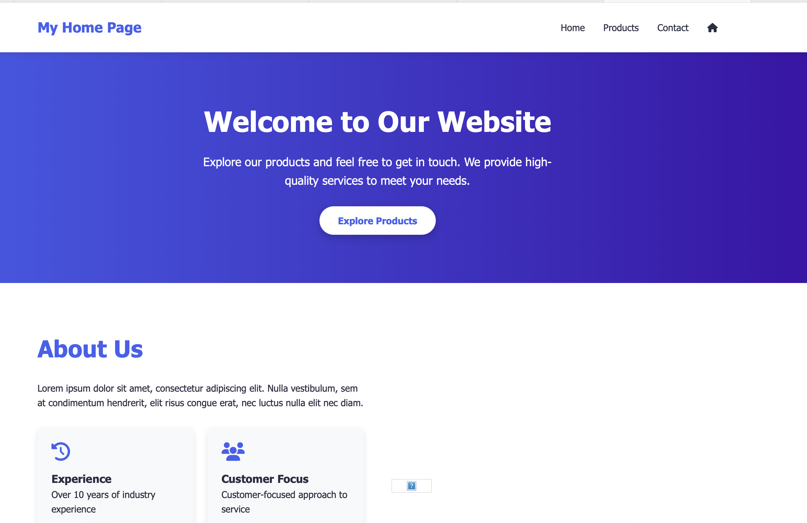
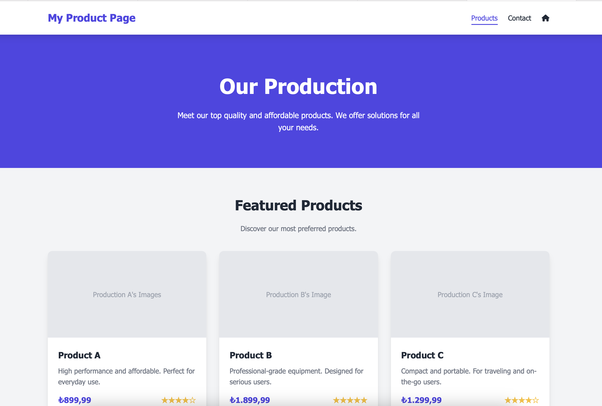
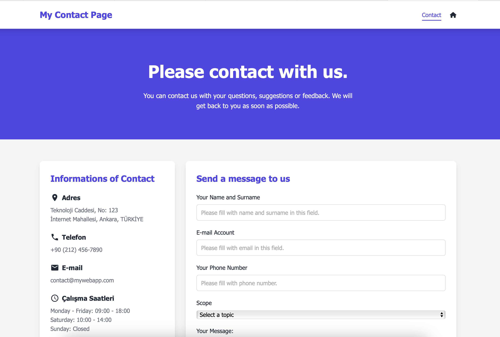

# ✅ Employee Management API

🚀 This project is a simple Node.js application that serves an Employee Management API. The API exposes endpoints to retrieve employee data, including the list of employees, the oldest employee, and the average salary of all employees.

## 🔹 Folder Tree
      nodejs-s1-proje/
    ├── 📁 assets/
    ├── 📁 dist/
    ├── 📁 node_modules/
    ├── 📁 src/
    ├── 📁 tasks/
    ├── 📄 docker-compose.yml
    ├── 📄 Dockerfile
    ├── 📄 noteForMe.md
    ├── 📄 package-lock.json
    ├── 📄 package.json
    ├── 📄 README.md
    └── 📄 tsconfig.json


## 🔹 Features

- **Employee List**: Returns a list of employees without salary information.
- **Oldest Employee**: Returns the details of the oldest employee.
- **Average Salary**: Calculates and returns the average salary of all employees.

## 🔹 Installation

1. Clone the repository:
    ```bash
    git clone <repository-url>
    ```

2. Navigate into the project directory:
    ```bash
    cd <project-directory>
    ```

3. Install the necessary dependencies:
    ```bash
    npm install
    ```

4. Start the server using nodemon for automatic reloading during development:
    ```bash
    npm run dev
    ```
5. For ts-node , typescript and @types/node package download, please run this.
    ```bash
    npm install --save-dev ts-node typescript @types/node
    ```
6. for running the project
    ```bash
    npx ts-node src/index.ts
    ```  
7. If you use @/utils and @components alias. you can run like this:
    ```bash
    npx ts-node --project tsconfig.json --loader ts-node/esm src/index.ts
    //or
    NODE_OPTIONS='--loader ts-node/esm' npx ts-node src/index.ts
    ```  

## 🔹 API Endpoints

1. 🔥 **GET `/employeeList`**
    - Returns a list of all employees without salary information.
    - Example:
      ```json
      [
        {
          "name": "Gamze",
          "surname": "Bilgin",
          "email": "gamze.bilgin@aitechcorp.com",
          "position": "Machine Learning Specialist",
          "start_date": "2025-01-10"
        },
        ...
      ]
      ```

2. 🔥 **GET `/oldestEmployee`**
    - Returns the details of the oldest employee.
    - Example:
      ```json
      {
        "name": "Burak",
        "surname": "Öztürk",
        "email": "burak.öztürk@aitechcorp.com",
        "position": "Software Architect",
        "start_date": "2019-02-17",
        "salary": 175000
      }
      ```

3. 🔥 **GET `/averageSalary`**
    - Returns the average salary of all employees.
    - Example:
      ```json
      {
        "averageSalary": 120000
      }
      ```

## 🔹 File Structure

/public
 - styles.css # CSS file for styling the application /pages
 - index.html # Homepage HTML
 - products.html # Products page HTML
 - contact.html # Contact page HTML /data
 - employeeList.json # JSON file containing employee data
 - server.js # Main server file for handling routes and requests

## 🔹 Page's Screenshot
The pages displayed in the screenshot below have been created as dummy pages.
These three HTML files serve as placeholders and were developed to facilitate understanding of the underlying logic
during backend and API development.

- 
- 
- 
## 🔹 License

This project is licensed under the MIT License - see the [LICENSE](LICENSE) file for details.

## 🔹 Acknowledgements

- Thanks to all contributors for their support and ideas.

## 🔹 Some Notes
  For control the ts-node version: run this script in terminal:
    ```
      npx ts-node -v
    ```